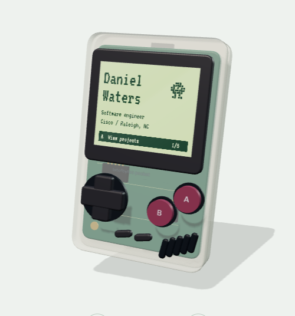
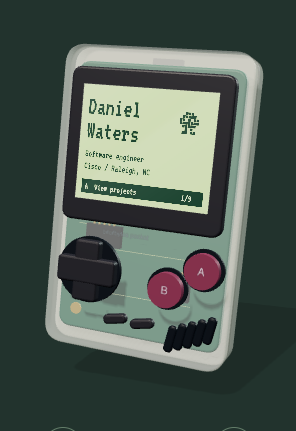

# Atomic integration comparison

These captures compare Daniel's approved Atomic mockup with its integration into BitOfBytes. They were captured locally from the owned mockup and application, not from the user's clipboard image.

Source mockup: `/Users/daniel/.codex/visualizations/2026/09/05/01a0718a-852b-7c13-ba4c-173a507b326e/homepage-atomic.html`.

The coordinator's code comparison confirmed that eleven geometry/control construction functions and the scene, material, and lighting setup are byte-identical to the approved source. The counter changes from `1/5` to `1/9` because the app supplies all eight existing projects plus About Daniel.

## Desktop, light appearance

Captured at 1024px content width. Both device images are 500 × 536 pixels. Their crop origins differ by one pixel due to page placement.

| Approved mockup | Integrated application |
| --- | --- |
|  |  |

Original captures: `output/playwright/atomic-reference-device-1024-light.png` and `output/playwright/atomic-app-device-1024-light.png`.

## Phone, dark appearance

Captured at 320px content width. Both device images are 296 × 431 pixels.

| Approved mockup | Integrated application |
| --- | --- |
|  |  |

Original captures: `output/playwright/atomic-reference-device-320-dark.png` and `output/playwright/atomic-app-device-320-dark.png`.
